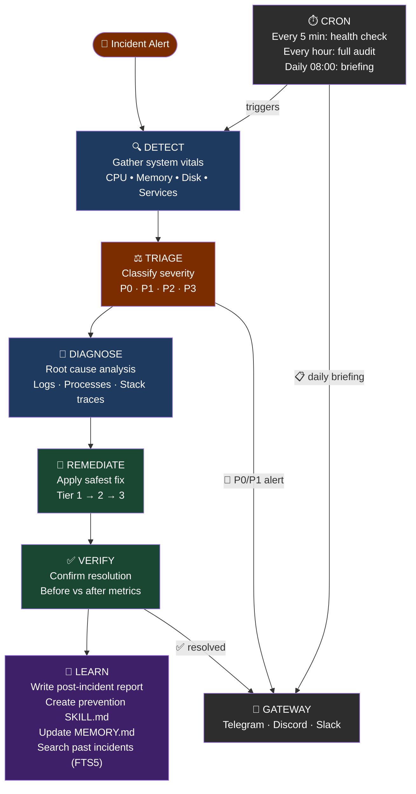
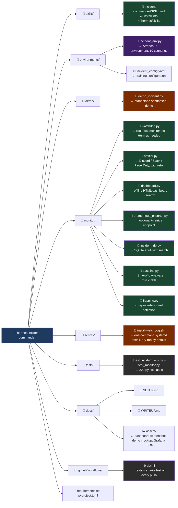
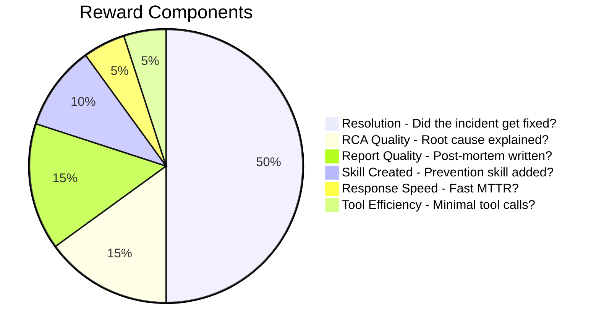

# ⚕ Hermes Incident Commander

[](https://github.com/Lethe044/hermes-incident-commander/actions/workflows/ci.yml)
[](LICENSE)
[](pyproject.toml)
[](CONTRIBUTING.md)

> **An autonomous SRE agent that detects, diagnoses, and heals production infrastructure - then learns from every incident it resolves.**

Originally built on [Hermes Agent](https://hermes-agent.nousresearch.com) by NousResearch
for the *"Show us what Hermes Agent can do"* hackathon. Now also ships a **standalone
watchdog** that runs on any real Linux host with nothing but an Anthropic API key -
no Hermes installation required.

---

## What's New

## Ontwikkeltijdlijn

<video src="https://raw.githubusercontent.com/itsdarklikehell/hermes-incident-commander/master/gource.mp4" controls width="100%"></video>


- 💬 **Microsoft Teams notification channel** - `TEAMS_WEBHOOK_URL` posts a
  MessageCard, colored by severity, alongside Discord/Slack/PagerDuty/the
  generic webhook.
- 📊 **Flapping/quiet-hours Prometheus gauges** - `hermes_watchdog_flapping`
  and `hermes_watchdog_in_quiet_hours` on `/metrics`, so an existing
  Grafana/Prometheus stack can show the same suppression state the
  dashboard and reports already do.
- ⏰ **Scheduled `--prune` via the systemd installer** - `install-watchdog.sh
  --with-prune-timer` sets up a daily systemd timer that runs
  `incident_db.py --prune --yes`, so retention doesn't need a manual or
  cron-it-yourself step.
- 🗄️ **`--prune --archive DIR`** - move old report files to cold storage
  instead of deleting them outright (the SQLite/history rows are removed
  from the active index either way).
- 🧹 **`incident_db.py --prune`** - removes incidents older than
  `--older-than-days` (report file, SQLite row, and `history.jsonl` line),
  dry-run by default, `--yes` to actually delete - keeps disk usage bounded
  on long-running installs.
- ⏳ **"Still ongoing" notification after quiet hours end** - if a breach
  starts during a quiet-hours window and is still active once the window
  closes, the very next poll sends one notification noting how long it's
  been running, instead of staying silent until an unrelated later poll
  happens to notice.
- 🧩 **Configurable generic-webhook payload template** - `GENERIC_WEBHOOK_TEMPLATE`
  lets the generic webhook match any target JSON shape (Discord embeds, a
  custom internal schema, ...) via `{source}`/`{title}`/`{message}`/`{severity}`
  placeholders, with no brace-escaping needed even for deeply nested JSON.
- ⬇️ **Download CSV button in the offline dashboard** - exports exactly
  what's currently visible in the incidents table (respects an active
  search or category-chart filter), client-side, no server.
- 🔕 **Quiet hours / maintenance windows** - configure recurring daily UTC
  windows (e.g. a known nightly batch job) during which breaches are still
  detected, reported, and indexed as normal, but the outbound notification
  is suppressed. Validated by `--validate-config` too.
- 🌐 **Generic webhook notification channel** - `GENERIC_WEBHOOK_URL` posts
  a small, stable JSON body (`source`, `title`, `message`, `severity`) to
  any endpoint, for platforms without first-class support here (Opsgenie,
  Microsoft Teams via a relay, an internal tool).
- 🖱️ **Clickable category chart in the offline dashboard** - click a bar in
  "Incidents by Category" to filter the recent-incidents table to that
  category, reusing the existing search box's filtering logic.
- 📤 **`incident_db.py --stats --format csv`** - the severity/category
  breakdown as a flat CSV, easy to chart in a spreadsheet.
- 💡 **Flapping incidents now suggest a concrete threshold fix** - instead
  of just repeating "this is flapping," the report proposes a specific new
  `cpu_threshold`/`mem_threshold`/`disk_threshold` value (learned from
  `--adaptive-thresholds` baseline data when available, otherwise a
  conservative bump) - and the watchdog throttles repeat notifications for
  the same ongoing flap so you're not paged over and over for the same
  known issue.
- 📊 **`incident_db.py --stats`** - total incidents, breakdown by severity
  and category, auto-remediation rate, incidents in the last 7/30 days,
  and the busiest category, as text or `--format json`.
- 🗂️ **Category breakdown chart in the offline dashboard** - a horizontal
  bar chart of incident counts by category, next to the severity and trend
  charts.
- 🐛 **Fixed a real path-isolation bug** in `flapping.py`, `baseline.py`,
  and `incident_db.py`: their default file-path arguments were bound at
  import time, so tests (or any other caller) patching the module-level
  path constant after import were silently ignored and could write to the
  real `~/.hermes/incidents/` instead of the intended location. Paths are
  now resolved fresh on every call.
- 📈 **Trend chart in the offline dashboard** - a 14-day incidents-per-day
  line chart (still a hand-rolled SVG, no chart.js) sits next to the
  severity breakdown so "is this getting better or worse" is visible at a
  glance.
- ✅ **`--validate-config`** - checks a `watchdog_config.yaml` for typos
  (unrecognized keys), out-of-range thresholds, and invalid allow-list
  entries, prints the resolved config, and exits - without starting the
  watchdog. Complements `--dry-run`, which validates behavior against live
  metrics rather than the config file itself.
- 📤 **CSV/JSON export from `incident_db.py --search`** - `--format json`
  or `--format csv` alongside the default human-readable text, so a search
  can be piped straight into a weekly incident-review report.
- 🔎 **Search box in the offline dashboard** - filter incidents by
  severity, category, root cause, or report filename, client-side, no server.
- 🔁 **Notifier retry/backoff** - a transient network blip during a real
  incident no longer means the page silently never goes out.
- 🌀 **Flapping detection** - 3+ incidents of the same category within an
  hour get flagged in the report, the console, and the dashboard instead of
  repeating silently forever.
- 🛠️ **`scripts/install-watchdog.sh`** - one-command systemd install for
  the watchdog. Dry-run by default; safe by design. See [Standalone Mode](#standalone-mode-no-hermes-required).
- 🔍 **Local incident search** - `monitor/incident_db.py` builds a SQLite +
  full-text-search index over your incident history, auto-updated after
  every incident. No server, no new dependency.
- 📅 **Adaptive, time-of-day-aware thresholds** - `--adaptive-thresholds`
  learns a per-hour baseline so a predictable nightly batch job doesn't page
  you, while still catching real anomalies. Opt-in; can only raise the bar
  above your configured threshold, never lower it.
- ☁️ **10 incident scenarios total** - including Docker, Kubernetes, ECS,
  and Lambda, alongside the original service/disk/memory/CPU/network ones.
- 📈 **Prometheus `/metrics` + a ready-to-import Grafana dashboard JSON**,
  and a **`--dry-run` mode** to preview `--auto-remediate` before trusting it.
- 📟 **PagerDuty integration** (trigger + auto-resolve), alongside
  Discord/Slack, with zero new dependencies.
- 🛰️ **Standalone Watchdog** - monitor a real host's CPU/memory/disk and failed
  systemd units, get Claude-powered triage, and (opt-in) safe auto-remediation.
  No Hermes install needed.
- 📊 **Offline HTML Dashboard**, **CI on every push**, a written
  **[SAFETY.md](SAFETY.md)** threat model, and a living **[ROADMAP.md](ROADMAP.md)**.

Full history in [CHANGELOG.md](CHANGELOG.md) · what's coming in [ROADMAP.md](ROADMAP.md).

---

## The Problem

When a production server goes down at 3 AM, an on-call engineer has to:

1. Wake up, check alerts
2. SSH in, run diagnostics manually
3. Piece together root cause from logs
4. Apply a fix - hopefully the right one
5. Verify it worked
6. Write a post-mortem nobody will read

**Mean time to resolve (MTTR) for P0 incidents averages 45–60 minutes.** Much of that is humans doing things a sufficiently capable agent could do faster and better.

Hermes Incident Commander does all of it - autonomously, in minutes, getting smarter with each incident it handles.

---

## Demo

```bash
# Install dependencies
pip install anthropic rich

# Set your API key
export ANTHROPIC_API_KEY=sk-ant-...

# Run a demo incident (disk full scenario)
python demo/demo_incident.py --scenario disk-full-logs

# Try other scenarios
python demo/demo_incident.py --scenario svc-crash-nginx
python demo/demo_incident.py --scenario cpu-runaway-process
```

**What you'll see:**
- Hermes detects the incident and classifies severity (P0/P1/P2/P3)
- Runs parallel diagnostics across CPU, memory, disk, and services
- Identifies root cause with explicit reasoning
- Applies the safest effective fix
- Verifies the fix worked
- Writes a structured post-incident report to `~/.hermes/incidents/`
- Creates a **new prevention skill** in `~/.hermes/skills/` so it handles this faster next time

<p align="center">
  
</p>

<p align="center"><sub>Illustrative example of what a run looks like - hand-assembled from real transcript
shapes, not a captured live session (turn count, timings, and exact tool calls will vary run to run).</sub></p>

> ⚠️ The demo and the RL training environment give the model **full terminal
> access**. Only run them in a disposable sandbox/VM/container - see
> [SAFETY.md](SAFETY.md).

---

## Standalone Mode (No Hermes Required)

You don't need a Hermes Agent installation to get real value out of this
project. `monitor/watchdog.py` runs as an always-on process on any Linux host
and needs nothing but `ANTHROPIC_API_KEY`:

```bash
pip install -e .              # or: pip install -r requirements.txt psutil

export ANTHROPIC_API_KEY=sk-ant-...
# optional, for real-time alerts (any subset - all can be set at once):
export DISCORD_WEBHOOK_URL=https://discord.com/api/webhooks/...
export SLACK_WEBHOOK_URL=https://hooks.slack.com/services/...
export TEAMS_WEBHOOK_URL=https://outlook.office.com/webhook/...
export PAGERDUTY_ROUTING_KEY=...
export GENERIC_WEBHOOK_URL=...        # any endpoint that accepts a JSON POST
export GENERIC_WEBHOOK_TEMPLATE='{"text": {message}}'   # optional - match a specific target's schema

# Single check - good for testing or a cron job
python -m monitor.watchdog --once

# Preview what --auto-remediate would do, without doing it
python -m monitor.watchdog --dry-run

# Continuous monitoring (observe-only by default)
python -m monitor.watchdog --cpu-threshold 85 --interval 30

# Opt in to SAFE, allow-listed auto-remediation (see monitor/watchdog_config.example.yaml)
python -m monitor.watchdog --config monitor/watchdog_config.yaml --auto-remediate

# Also serve Prometheus-format metrics at http://127.0.0.1:9877/metrics
python -m monitor.watchdog --metrics-port 9877

# Learn a per-hour baseline so a predictable nightly batch job doesn't page you
python -m monitor.watchdog --adaptive-thresholds
python -m monitor.watchdog --show-baseline

# Search past incidents ("have we seen this before?") - no server, just SQLite
python -m monitor.incident_db --sync
python -m monitor.incident_db --search "nginx"
python -m monitor.incident_db --search "nginx" --format json     # or --format csv
python -m monitor.incident_db --stats                            # or --format json/csv
python -m monitor.incident_db --prune --older-than-days 90       # dry run
python -m monitor.incident_db --prune --older-than-days 90 --yes # actually remove
python -m monitor.incident_db --prune --older-than-days 90 --archive /backup/incidents --yes

# Check a config file for typos/invalid allow-list entries before using it
python -m monitor.watchdog --config monitor/watchdog_config.yaml --validate-config

# One-command systemd install (dry-run by default - see exactly what it would do)
./scripts/install-watchdog.sh
sudo ./scripts/install-watchdog.sh --yes --auto-remediate --adaptive-thresholds
sudo ./scripts/install-watchdog.sh --yes --with-prune-timer --prune-older-than-days 90
```

Unlike the demo/training environment, the watchdog **never gives the model
shell access**. It collects real metrics with `psutil`, sends only numbers to
Claude, and any remediation is restricted to an explicit allow-list you
configure (restart *this specific* service, clean *this specific* log
directory). Full threat model in [SAFETY.md](SAFETY.md). `--dry-run` runs one
check and prints exactly what would be restarted or deleted (prefixed
`[DRY RUN]`) without doing it or notifying anyone - a safe way to validate a
new `watchdog_config.yaml` before turning `--auto-remediate` on for real.

`--adaptive-thresholds` (`monitor/baseline.py`) learns a running mean/stddev
per hour-of-day from the watchdog's own polls. It can only ever **raise**
the effective threshold above what you configured - never lower it - and is
capped at 1.5x your static threshold, so a real ongoing incident can't
slowly train the watchdog into ignoring itself. It's off by default; nothing
changes unless you opt in.

`monitor/notifier.py` fans an alert out to every channel you've configured -
Discord, Slack, Microsoft Teams, a generic webhook, and/or PagerDuty (via
the Events API v2) - so it's safe to set all of them; nothing extra fires
for channels you leave unconfigured. When PagerDuty is configured, the
watchdog also tracks which breach types have an open incident and calls
PagerDuty's resolve endpoint automatically once things recover, instead of
leaving pages open forever. Delivery to any channel now retries transient
failures (timeouts, connection drops, HTTP 429/5xx) with exponential
backoff, so a brief network blip during a real incident doesn't mean the
page silently never arrives.

If the same category of incident fires 3+ times within an hour,
`monitor/flapping.py` flags it - a "⚠️ FLAPPING DETECTED" banner at the top
of the report, a console warning, and a badge in the dashboard - since
that's usually either a root cause that isn't actually fixed, or a
threshold tuned too tight for normal load. For cpu/mem/disk, the banner
also proposes a concrete new threshold (`suggest_threshold()` - a learned
`--adaptive-thresholds` baseline value when trusted data exists, otherwise
a conservative bump) instead of just repeating the warning forever. Once a
category has crossed the flapping threshold and been alerted on once, the
watchdog throttles further Discord/Slack/PagerDuty/webhook notifications
for that same ongoing flap - the report and `history.jsonl` still record
every occurrence, only the repeat page is suppressed.

The same suppression applies during a configured **quiet hours** window -
a recurring daily UTC time range (e.g. a known nightly batch job) set via
`quiet_hours` in the config:

```yaml
quiet_hours:
  - start: "02:00"
    end: "03:00"          # daily, every day
  - start: "23:00"
    end: "05:00"
    days: [sat, sun]       # only Saturday and Sunday nights
```

Breaches inside a quiet-hours window are still detected, written to the
report, and indexed as normal - only the outbound notification is
suppressed, which is different from `--dry-run` (which also skips
auto-remediation and PagerDuty bookkeeping entirely). If a breach is still
active once the window closes, the next poll sends one notification
noting how long it's been running - "silent during quiet hours" doesn't
mean "silent forever" if the problem outlasts the maintenance window.

Every incident is also indexed by `monitor/incident_db.py` (SQLite, with a
full-text search index when your Python's SQLite has FTS5 - falling back to
a plain `LIKE` scan otherwise) so "have we seen this before?" works without
a full Hermes install. `write_incident()` keeps it in sync automatically;
`--sync`/`--search` are there for manual use or a cron job, `--format
json`/`--format csv` let you pipe a search straight into another tool or a
weekly incident-review report instead of only reading it on screen,
`--stats` (also `--format json`/`--format csv`) prints a quick summary
(totals, by severity/category, auto-remediation rate, last 7/30 days,
busiest category), and `--prune --older-than-days N` (dry-run unless
`--yes`) removes old incidents - their report file, SQLite row, and
`history.jsonl` line - so a long-running install doesn't grow `INCIDENT_DIR`
forever.

Before trusting a new `watchdog_config.yaml`, run `--validate-config`: it
flags unrecognized keys (a likely typo), thresholds outside 0-100,
negative intervals, malformed `quiet_hours` windows, and allow-list entries
that don't actually match anything (like a `restart_services` entry for a
service that isn't in `watched_services`) - then prints the fully resolved
config and exits, without starting the watchdog.

Want it running on boot without setting up the systemd unit by hand?
[`scripts/install-watchdog.sh`](scripts/install-watchdog.sh) does that in
one command - dry-run by default, and it writes your API key/secrets to a
root-only file rather than into the unit file itself. Add
`--with-prune-timer` to also install a daily systemd timer that runs
`incident_db.py --prune --yes` (`--prune-older-than-days` to change the
threshold, default 90), so retention doesn't need a manual/cron-it-yourself
step. `--uninstall --yes` removes everything this installed, watchdog
service and prune timer alike.

Once you have some incident history, generate a dashboard:

```bash
python -m monitor.dashboard --open
```

This writes a single, self-contained HTML file (no server, no external
requests) summarizing incident counts by severity and category (click a
category bar to filter the table below to it), a 14-day incidents-per-day
trend, auto-remediation rate, and a searchable recent-incidents table with
a "Download CSV" button that exports exactly what's currently visible
(respects an active search or category filter), client-side, no server
round-trip.

<p align="center">
  
</p>

<p align="center"><sub>Real output of <code>monitor/dashboard.py</code> - rendered from sample incident history (including the category breakdown, 14-day trend chart, search box with CSV export, and a flapping badge), not a mockup.</sub></p>

If you already run Prometheus and Grafana, you can scrape the watchdog
directly instead of (or alongside) the dashboard - `--metrics-port` starts a
tiny, dependency-free `/metrics` endpoint (`monitor/prometheus_exporter.py`)
exposing `hermes_watchdog_cpu_percent`, `hermes_watchdog_mem_percent`,
`hermes_watchdog_disk_percent`, `hermes_watchdog_failed_services_count`,
a `hermes_watchdog_breach{metric="..."}` gauge per tracked metric, and
`hermes_watchdog_flapping`/`hermes_watchdog_in_quiet_hours` reflecting the
current incident's suppression state. It binds to `127.0.0.1` by default
and is read-only - it cannot be used to control the watchdog. Import
[`docs/assets/grafana-dashboard.json`](docs/assets/grafana-dashboard.json)
into Grafana to get CPU/memory/disk gauges and a breach timeline without
building panels by hand.

---

## How It Uses Every Hermes Feature

This project was designed to push every capability of Hermes Agent:

| Hermes Feature | How It's Used |
|---|---|
| **Persistent Memory** | Builds a system topology map over time. Learns which services fail together, time-of-day patterns, and which remediations work on YOUR infrastructure. |
| **Skill Auto-Creation** | After every novel incident, writes a new `SKILL.md` prevention playbook. Hermes gets measurably better at your stack over weeks. |
| **Cron Scheduler** | Every 5 min: critical health check. Every hour: full audit. Daily 08:00: morning briefing to Telegram. |
| **Gateway (Telegram/Discord/PagerDuty)** | Real-time P0 alerts, resolution notices, and daily briefings delivered to your phone or on-call rotation. |
| **Subagent Spawning** | For multi-service environments, spawns parallel subagents to investigate nginx, database, and application layers simultaneously. |
| **Session Search (FTS5)** | "Have we seen this error before?" - searches past incidents for matching patterns. |
| **execute_code** | Collapses multi-step diagnostic pipelines into single inference turns, dramatically reducing latency. |
| **MCP Integration** | Connects to cloud provider APIs (AWS/GCP/Azure MCP servers) for auto-scaling and cloud-native remediation. |

---

## Architecture



---

## Project Structure



---

## Installation (Full Hermes Setup)

### 1. Install Hermes Agent

```bash
curl -fsSL https://raw.githubusercontent.com/NousResearch/hermes-agent/main/scripts/install.sh | bash
```

### 2. Configure Hermes

```bash
hermes setup        # Interactive setup wizard
hermes model        # Choose your model (Nous Portal recommended)
hermes gateway setup  # Connect Telegram/Discord for alerts
```

### 3. Install the Incident Commander Skill

```bash
# Copy the skill to Hermes's skills directory
cp -r skills/incident-commander ~/.hermes/skills/

# Verify it's loaded
hermes
> /skills
```

### 4. Set Up Monitoring Cron Jobs

In your Hermes conversation:
```
Set up incident monitoring: run a health check every 5 minutes and alert me
on Telegram if anything is P0 or P1. Send me a daily briefing at 08:00.
```

Hermes will install the cron jobs automatically.

### 5. Run the RL Training Environment (Optional)

```bash
# Install Atropos
pip install atroposlib

# Generate SFT training data
python environments/incident_env.py process --config environments/incident_config.yaml

# Full RL training (requires VLLM)
python environments/incident_env.py serve --config environments/incident_config.yaml
```

---

## Reward Function (for RL Training)

The training environment uses a multi-component reward that captures real SRE quality:



---

## Incident Scenarios (Training Scenarios)

| ID | Severity | Category | Description |
|---|---|---|---|
| `svc-crash-nginx` | P0 | service | nginx crashed, website unreachable |
| `disk-full-logs` | P1 | disk | 95% disk usage from exploded log files |
| `memory-leak-process` | P1 | memory | Mystery process eating 150MB+ |
| `docker-container-crash` | P1 | docker | Container stuck in a restart/crash loop |
| `k8s-pod-crashloop` | P1 | kubernetes | Pod stuck in CrashLoopBackOff |
| `ecs-task-crashloop` | P1 | ecs | ECS task stuck in a deploy/rollback loop |
| `network-unreachable` | P1 | network | Upstream dependency unreachable, timeouts spiking |
| `cpu-runaway-process` | P2 | cpu | 95% CPU from runaway computation |
| `failed-systemd-unit` | P2 | service | Custom worker service in failed state |
| `lambda-timeout-spike` | P2 | lambda | Lambda function timing out on cold starts |

---

## Running Tests

```bash
# Install test dependencies
pip install pytest pytest-asyncio psutil

# Fast sanity check, no dependencies beyond the stdlib + pyyaml
python environments/incident_env.py --smoke-test

# Run full test suite (220 tests: scenarios, reward function, skill file,
# demo script, notifier incl. Teams/PagerDuty + retry/backoff + generic
# webhook w/ custom templates, watchdog dry-run/resolve wiring/
# --validate-config/notification throttling/quiet hours + still-ongoing
# notice, Prometheus exporter incl. flapping/quiet-hours gauges, incident
# search + stats + prune/archive (SQLite/FTS + CSV/JSON export), adaptive
# baseline, flapping detection + threshold suggestion, dashboard incl.
# search box + trend + clickable category charts + CSV download)
pytest tests/ -v

# Run specific test classes
pytest tests/test_incident_env.py::TestScenarioDefinitions -v
pytest tests/test_incident_env.py::TestRewardFunction -v
pytest tests/test_monitor.py::TestSafeRemediation -v
```

CI runs both of the above automatically on every push and PR across Python
3.10, 3.11, and 3.12 - see the badge at the top of this README or
[`.github/workflows/ci.yml`](.github/workflows/ci.yml).

---

## Why This Project Is Worth Using

1. **Real problem, real impact.** P0 incidents cost companies thousands of dollars per minute. Shaving 30 minutes off MTTR with an autonomous agent is immediately valuable.

2. **Uses every Hermes capability.** Memory, skills, cron, gateway, subagents, session search, execute_code - all integrated into a coherent, meaningful workflow.

3. **Self-improving.** The longer Hermes runs, the better it gets at your specific infrastructure. This is Hermes's core promise - "the agent that grows with you" - demonstrated concretely.

4. **Closes the training loop.** The Atropos RL environment means this isn't just a demo - it's a path to training models that are genuinely better at agentic SRE tasks.

5. **Works standalone, today, on a real host.** `monitor/watchdog.py` doesn't need Hermes at all - just `ANTHROPIC_API_KEY` - and is built with an explicit, documented safety model instead of giving an LLM raw shell access to your production box.

6. **Ships with working code and CI.** The demo runs standalone, 220 tests pass, GitHub Actions verifies every push, and the skill file installs in one command.

---

## Star History

<a href="https://star-history.com/#Lethe044/hermes-incident-commander&Date">
  <picture>
    <source media="(prefers-color-scheme: dark)" srcset="https://api.star-history.com/svg?repos=Lethe044/hermes-incident-commander&type=Date&theme=dark" />
    
  </picture>
</a>

## Contributing

New incident scenarios, notifier integrations, and dashboard improvements are
welcome - see [CONTRIBUTING.md](CONTRIBUTING.md) for how to get set up and
what a good PR looks like, and [ROADMAP.md](ROADMAP.md) if you want ideas.
This project is meant to keep growing - if you use it and hit a rough edge,
please open an issue even if you don't have time to fix it yourself.

## Safety

Please read [SAFETY.md](SAFETY.md) before pointing anything in this repo at
a machine you care about - demo mode and the watchdog have very different
risk profiles.

## License

MIT - see [LICENSE](LICENSE).

---

*Built with [Hermes Agent](https://hermes-agent.nousresearch.com) - the agent that grows with you.*